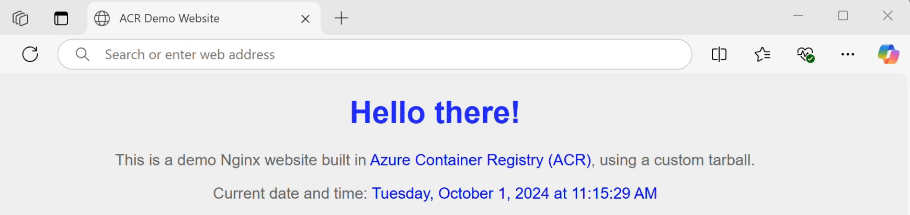

# Azure Container Registry: Building Custom Images from OCI Artifacts

An OCI (Open Container Initiative) artifact is a standardised, portable and secure way to package and distribute software. It defines a common format for container images and supporting files, ensuring consistent execution across various operating systems and container runtimes. Azure Container Registry (ACR) natively supports the creation and management of OCI artifacts.

This repository demonstrates how to use the **Azure CLI** and **ORAS CLI** tools to build a customised Docker image of an Nginx web service. It includes a sample tarball and Dockerfile to facilitate end-to-end testing, from creating an OCI artifact to deploying a fully functional web site.

> [!NOTE]
> This step-by-step guide assumes you are using Windows 11 on your development machine.

## Table of Contents
* [Pre-requisites](#pre-requisites)
* [Step 1: Create an OCI Artifact](#step-1-create-an-oci-artifact)
* [Step 2: Create an ACR Agent Pool](#step-2-create-an-acr-agent-pool)
* [Step 3: Build a Docker Image](#step-3-build-a-docker-image)
* [Step 4: Deploy a Web site](#step-4-deploy-a-web-site)

## Pre-requisites
1. Resources:
    - **_Azure Subscription_**: Ensure you have an active Azure subscription with an Entra ID account.
    - **_Azure Container Registry_**: Create an ACR instance.
    - **_Docker_**: Install Docker on your development machine.
2. Environment Variables:
    - Once you have these resources, set the following environment variables for the CLI commands in the upcoming steps. Replace the placeholders with your actual values:
    ``` shell
    set MyRegistry=<YOUR_ACR_RESOURCE>
    set MyRegistryFQDN=<YOUR_ACR_RESOURCE>.azurecr.io
    set MyResourceGroup=<RESOURCE_GROUP_OF_ACR>
    set MyAgentPool=<ACR_POOL_NAME>
    set MyTask=<CUSTOM_ACR_TASK_NAME>
    set MyImage=<TARGET_IMAGE_NAME>
    set MyBlob=<TARBALL_FILE_NAME>
    ```

## Step 1: Create an OCI Artifact
1. Follow the installation instructions for the **_ORAS CLI_** tool [here](https://oras.land/docs/installation).
2. Login to ACR with your Entra ID credentials:
``` PowerShell
az acr login --name %MyRegistry%
```
3. Push the **_tarball_** and **_Dockerfile_** to ACR, creating an OCI artifact:
``` PowerShell
oras.exe push %MyRegistryFQDN%/demotar:v1 demopage.tar.gz:application/x-tar Dockerfile:text/plain
```
4. Verify the structure of the created OCI artifact by fetching its manifest:
``` PowerShell
oras manifest fetch --pretty %MyRegistryFQDN%/demotar:v1
```
> [!NOTE]
> The _application/x-tar_ and _text/plain_ media types provide metadata describing the uploaded file types.

## Step 2: Create an ACR Agent Pool
1. To enhance security, you can disable _public access_ to your ACR. This restricts access to your environment.
2. Create an ACR **_agent pool_** using the following command:
``` PowerShell
az acr agentpool create -n %MyAgentPool% -r %MyRegistry%
```
3. Verify that the new agent pool is listed in your registry:
``` PowerShell
az acr agentpool list -r %MyRegistry%
```
> [!NOTE]
> An Agent Pool provides the compute resources required to run the Docker build process.

## Step 3: Build a Docker Image
1. Create a new ACR task with a system-assigned managed identity:
``` PowerShell
az acr task create --image %MyImage%:latest --name %MyTask% --registry %MyRegistry% --resource-group %MyResourceGroup% --auth-mode Default --commit-trigger-enabled false --agent-pool lazizacrpool --file Dockerfile --context oci://%MyRegistryFQDN%/demotar:v1 --assign-identity
```
2. In Azure portal, assign the **ACRPull** role to the ACR task's managed identity.
3. Execute the newly created ACR task to build the custom Docker image from the OCI artifact:
``` PowerShell
az acr task run --name %MyTask% --registry %MyRegistry%
```
> [!NOTE]
> Use of trusted Azure services (when public access is blocked) is supported for a system-assigned managed identity only.

## Step 4: Deploy a Web site
1. Verify that your custom Docker image is listed in the ACR repository:
``` PowerShell
az acr repository list --name %MyRegistry% --output table
```
2. You can use the ```show-tags``` command to check the available tags for your image:
``` PowerShell
az acr repository show-tags --name %MyRegistry% --repository %MyImage% --output table
```
3. Now you can deploy your Web site by running the image as a Docker container. This command maps port 8080 on your local machine to port 80 within the container:
``` PowerShell
docker run -d --name %MyTask% -p 8080:80 %MyRegistry%.azurecr.io/%MyImage%:latest
```
4. You can verify the results by opening the Web page http://localhost:8080/ in your local browser.

